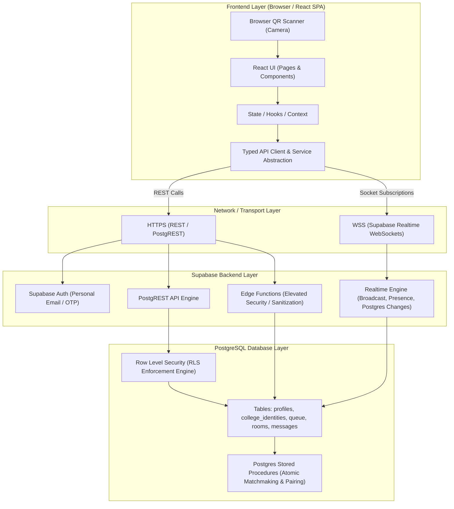

# High-Level System Architecture: TALK TO RITIANS

This document outlines the multi-tiered architecture of **Talk to RITians**, an anonymous 1-to-1 chat platform tailored for verified students of Rajalakshmi Institute of Technology.

---

## 1. Architectural Overview

---

## 2. Layer Responsibilities

### 2.1 Frontend Layer (React + Vite + TypeScript + Tailwind)
- **Presentation & UX**: Renders responsive, accessible views for landing, QR scanning, avatar configuration, matchmaking radar, and real-time chat.
- **Client State**: Manages local UI state, loading states, toasts, camera streams, and input validation.
- **Service Abstraction**: All database and auth interactions pass through typed service interfaces (`IAuthService`, `IVerificationService`, `IMatchmakingService`, `IChatService`). Components never make arbitrary ad-hoc DB queries.
- **Privacy Enforcement (Client-Side)**: Strictly renders only `AnonymousIdentity` (username & avatar) in chat views.

### 2.2 Transport Layer (HTTPS & WebSockets)
- **PostgREST (HTTPS)**: Handles transactional read/write operations (profile updates, queue joins, room lookups) authenticated by user JWT.
- **Realtime (WSS)**: Delivers instant message broadcast, typing status, user presence, and peer disconnect notices with sub-second latency.

### 2.3 Supabase Backend Layer
- **Supabase Auth**: Manages personal email login, issuing signed JWTs containing the user's `auth.uid()`.
- **Row Level Security (RLS)**: Enforces table-level access policies directly at the PostgreSQL layer, preventing client tampering.
- **Edge Functions (Deno)**: Used where specialized server validation or secret rotation is required (e.g. verifying cryptographically signed college tokens if needed).

### 2.4 PostgreSQL Database Layer
- **Data Persistence**: Stores user profiles, hashed college identity records, active matchmaking queues, chat rooms, and conversation messages.
- **Atomic Matchmaking RPC**: Uses PostgreSQL functions (`SELECT FOR UPDATE SKIP LOCKED`) to atomically pair two searching students into a shared `chat_room` without race conditions or dual assignments.
- **Identity Privacy Partition**: Completely isolates `college_identities` so queries from ordinary clients return strictly empty sets unless queried by the owning user via authenticated RPC.

---

## 3. Data Flow Pipelines

### Flow A: College Identity Verification & Linking
1. User logs in with personal email via Supabase Auth (`accountState = 'unverified'`).
2. User scans their physical college ID card using the browser camera.
3. QR scanner outputs raw text payload → passed to `qrParserRegistry.parse(rawText)`.
4. Extracted identity payload is sent to `linkCollegeIdentity()` backend procedure.
5. Procedure computes SHA-256 hash of the unique student ID.
6. Database checks if hash already exists:
   - **If exists**: Rejects linking with `COLLEGE_ID_ALREADY_LINKED` error (prevents multiple accounts per student).
   - **If unique**: Inserts record into `college_identities` and marks user as `isCollegeVerified = true`.

### Flow B: Random Matchmaking
1. Verified user clicks "Find RITian".
2. Client calls `joinMatchmaking()`.
3. Database inserts entry into `matchmaking_queue` with status `searching`.
4. Trigger/RPC executes atomic pairing with another `searching` student:
   - Creates a new record in `chat_rooms`.
   - Updates both queue entries to `matched` with `matchedRoomId`.
5. Both clients receive the Realtime event with `roomId` and transition to the chat screen.

### Flow C: Real-Time 1-to-1 Anonymous Chat
1. Both clients join room channel `realtime:chat_rooms:<roomId>`.
2. When User A types and hits Send, `sendMessage(roomId, text)` inserts row into `chat_messages`.
3. PostgreSQL Realtime broadcasts `INSERT` payload to Room channel.
4. User B's client receives message and appends to UI.
5. When a user clicks **Skip** or **Leave**:
   - Status in `chat_rooms` updates to `skipped` or `ended`.
   - Realtime notification alerts the peer: *"Stranger has left the chat"*.
   - User transitions back to matchmaking or dashboard.
